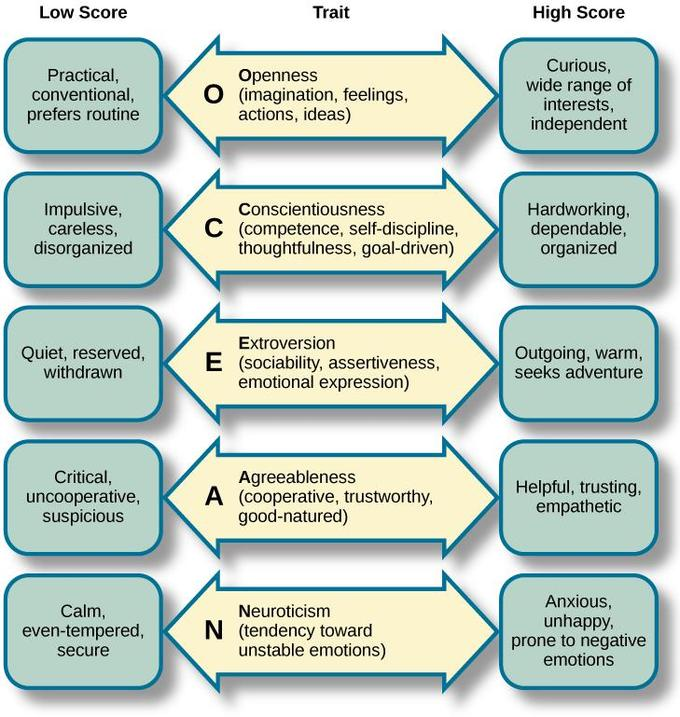

<div class="logo">

</div>

```{r setup, include=FALSE,comment=NA, results='asis'}
knitr::opts_chunk$set(echo = FALSE, message=FALSE, warning=FALSE, cache=FALSE,comment = NA,results = 'hide')
```


```{r pressure, echo=FALSE}

library(RMySQL)
library(plotly)
 mydb = dbConnect(MySQL(), user='root', password='Kishan@19972', dbname='persona', host='127.0.0.1', port=3306, DBMSencoding="UTF-8")
  
  query <- sprintf(
      "Select * from t_userdetails ORDER BY U_ID DESC LIMIT 1"
    )
    
   
   query1 <- sprintf(
      "Select * from t_result ORDER BY R_ID DESC LIMIT 1"
    )
   
   query2 <- sprintf(
      "Select * from t_result_tag ORDER BY R_ID DESC LIMIT 1"
    )
     
    
    User <- dbGetQuery(mydb, query)
    
    Result<- dbGetQuery(mydb, query1)
    
    Result1 <- dbGetQuery(mydb, query2)
    
    dbDisconnect(mydb)
    
     Traits <- names(Result)
    
    Sentiments <- unname(unlist(Result[1,]))
 
   F_result <- data.frame(Traits,Sentiments)
   
    Traits_t <- names(Result1)
    
    Sentiments_t <- unname(unlist(Result1[1,]))
 
   F_result_t <- data.frame(Traits_t,Sentiments_t)
```

<br/>


###Personal Details:

<b>Name: </b> `r User$Name`<br/>

<b>TwitterID:</b> `r User$Screen_name`<br/>

<b>Location:</b> `r User$Location` <br/>

<b>Description: </b>`r User$Description`<br/>

<b>Instagram URL:</b> `r User$Instagram_url`<br/>

<b>Followers:</b> `r format(User$Followers,scientific=FALSE)` <br/>

<b>Following:</b> `r User$Following`<br/>

<b>Tweets: </b>`r format(User$Tweet_count,scientific=FALSE)` <br/>

<b>Account Created on:</b> `r User$Account_created`<br/>

<b>Verified Account: </b>`r User$Verified`


<P style="page-break-before: always">

<br/>

###Personality Traits Rating based on User Profile:

```{r plot1,results='asis'}  
  
    
    plot1 <- F_result[c(4:13),]
    
    #knitr::kable(x = plot1, digits = 2)
   plot1$Traits <- factor(plot1$Traits)
     p1 <- plot_ly(plot1,x=~Traits,y=~Sentiments,type='bar')
     p1
    
```


###Personality Traits Rating based on Public Opinion:

```{r plot1.1,results='asis'}  
  
    
    plot1.1 <- F_result_t[c(4:13),]
    
    #knitr::kable(x = plot1, digits = 2)
   plot1.1$Traits_t <- factor(plot1.1$Traits_t)
     p1.1 <- plot_ly(plot1.1,x=~Traits_t,y=~Sentiments_t,type='bar',height = 400,width = 700)
     p1.1
    
```

<P style="page-break-before: always">

<br/>

###Positive Negative Tweet Ratio based on User Profile:

``` {r plot3,results='asis'}
    plot3 <- F_result[c(14:16),]
    plot3$Traits <- factor(plot3$Traits)
    plot3$Traits <- c("Positive","Negative", "Neutral")
    p3  <- plot_ly(plot3, labels = ~Traits, values = ~Sentiments, type = 'pie',
                     textposition = 'inside',
                     textinfo = 'label+percent',
                     insidetextfont = list(color = '#FFFFFF'),
                     hoverinfo = 'text',
                     text = ~paste(Sentiments),
                     marker = list(colors = colors,
                                   line = list(color = '#FFFFFF', width = 1)),
                     #The 'pull' attribute can also be used to create space between the sectors
                     showlegend = FALSE) %>%
        layout(
               xaxis = list(showgrid = FALSE, zeroline = FALSE, showticklabels = FALSE),
               yaxis = list(showgrid = FALSE, zeroline = FALSE, showticklabels = FALSE,height = 400,width = 700))
    
    p3
```


###Positive Negative Tweet Ratio based on Public Opinion:

``` {r plot3.1,results='asis'}
    plot3.1 <- F_result_t[c(14:16),]
    plot3.1$Traits_t <- factor(plot3.1$Traits_t)
    plot3.1$Traits_t <- c("Positive","Negative", "Neutral")
    p3.1  <- plot_ly(plot3.1, labels = ~Traits_t, values = ~Sentiments_t, type = 'pie',
                     textposition = 'inside',
                     textinfo = 'label+percent',
                     insidetextfont = list(color = '#FFFFFF'),
                     hoverinfo = 'text',
                     text = ~paste(Sentiments_t),
                     marker = list(colors = colors,
                                   line = list(color = '#FFFFFF', width = 1)),
                     #The 'pull' attribute can also be used to create space between the sectors
                     showlegend = FALSE) %>%
        layout(
               xaxis = list(showgrid = FALSE, zeroline = FALSE, showticklabels = FALSE),
               yaxis = list(showgrid = FALSE, zeroline = FALSE, showticklabels = FALSE,height = 400,width = 700))
    
    p3.1
```

<br/>

###OCEAN Personality Indicator based on User Profile:

```{r plot2,results='asis'}
    plot2 <- F_result[c(17:26),]
    
    plot2$Traits <- factor(plot2$Traits)
    
    plot2_h <- plot2[c(1,3,5,7,9),]
    
    plot2_l <- plot2[c(2,4,6,8,10),]
    
    high <- plot2_h$Sentiments
    low <- plot2_l$Sentiments
    names <- c("Extraversion","Neuroticism","Conscientiousness","Openness","Agreeableness")
    
    plot2_f <- data.frame(names,high,low)
    
    
    p2 <- plot_ly(plot2_f, x = ~names, y = ~high, type = 'bar', name = 'Likely', marker = list(color = 'rgb(49,130,189)')) %>%
        add_trace(y = ~low, name = 'Unlikely', marker = list(color = 'rgb(204,204,204)')) %>%
        layout(xaxis = list(title = "", tickangle = -45),
               yaxis = list(title = ""),
               margin = list(b = 100),
               barmode = 'group',height = 400,width = 700)
    p2
```


###OCEAN Personality Indicator based on Public Opinion:

```{r plot2.1,results='asis'}
    plot2.1 <- F_result_t[c(17:26),]
    
    plot2.1$Traits_t <- factor(plot2.1$Traits_t)
    
    plot2_h.1 <- plot2.1[c(1,3,5,7,9),]
    
    plot2_l.1 <- plot2.1[c(2,4,6,8,10),]
    
    high <- plot2_h.1$Sentiments_t
    low <- plot2_l.1$Sentiments_t
    names <- c("Extraversion","Neuroticism","Conscientiousness","Openness","Agreeableness")
    
    plot2_f.1 <- data.frame(names,high,low)
    
    
    p2.1 <- plot_ly(plot2_f.1, x = ~names, y = ~high, type = 'bar', name = 'Likely', marker = list(color = 'rgb(49,130,189)')) %>%
        add_trace(y = ~low, name = 'Unlikely', marker = list(color = 'rgb(204,204,204)')) %>%
        layout(xaxis = list(title = "", tickangle = -45),
               yaxis = list(title = ""),
               margin = list(b = 100),
               barmode = 'group',height = 400,width = 700)
    p2.1
```

<br/>

<div class="ocean">
```{r echo=FALSE, out.width='80%',out.height='80%',results='asis'}

```
</div>


<br/>
<br/>
<br/>
<br/>
<br/>
<br/>
<br/>
<br/>
<br/>
<br/>


## <i>Thank you for using <b>PERSONA</b></i>


